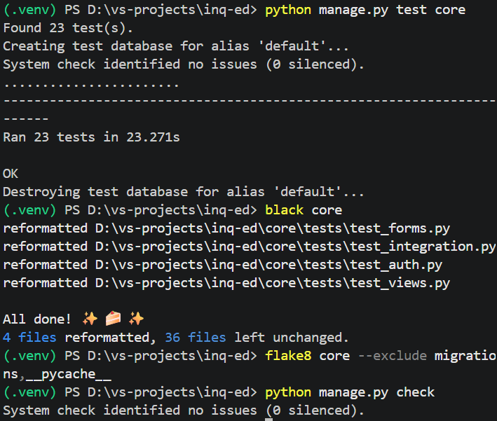
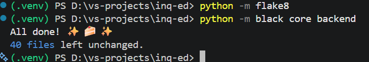
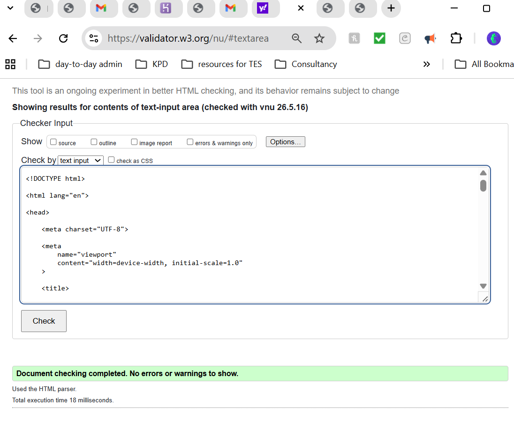
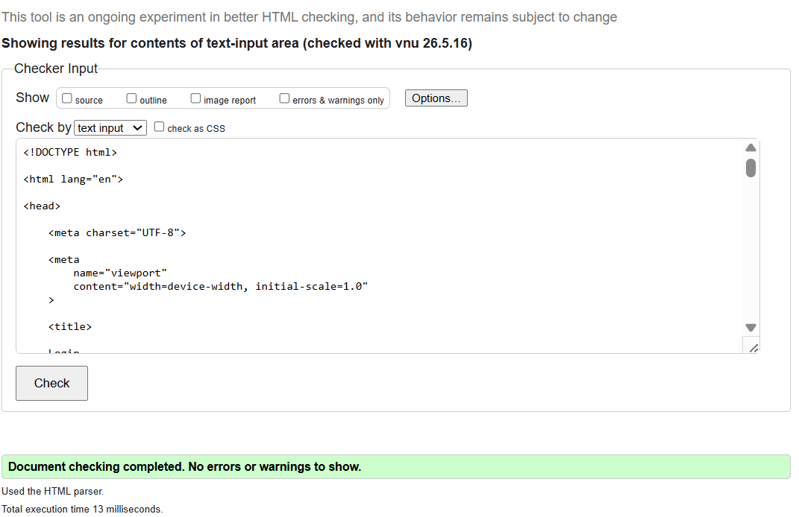
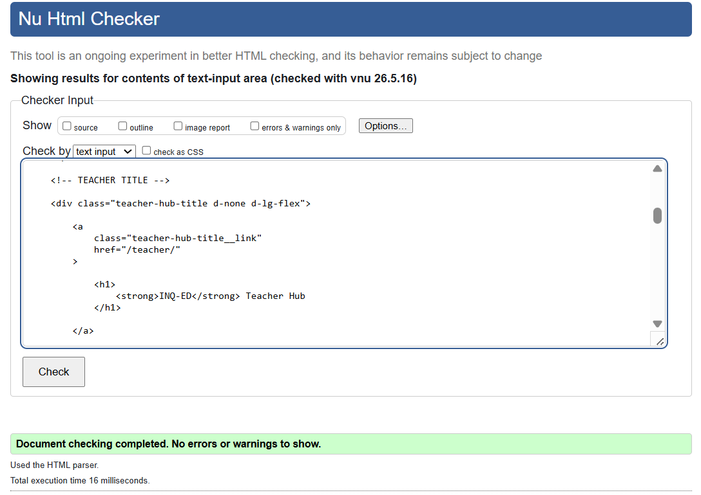
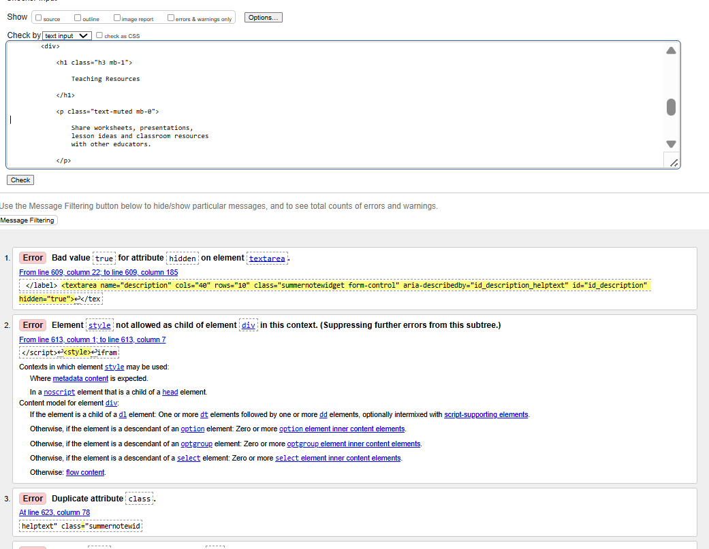
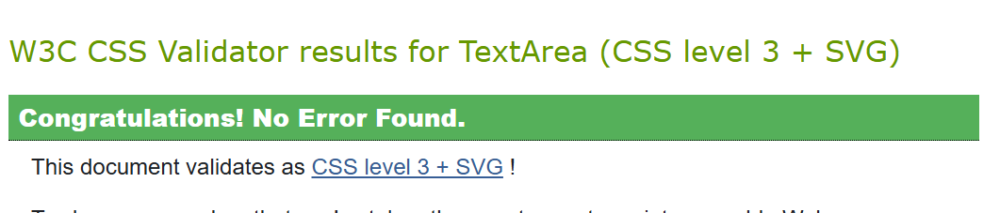
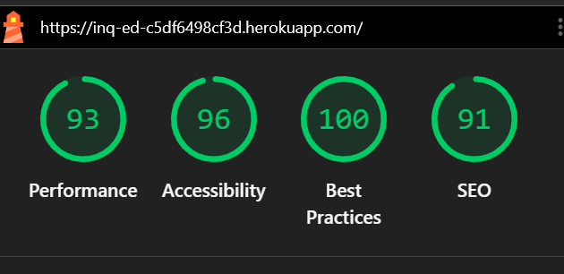
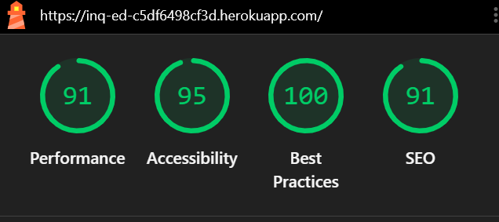

# INQ-ED – Inquiry-Based Educational Platform


## Installation

Follow these steps to set up the project locally.

1. Create and activate a virtual environment:

```bash
python -m venv .venv
# Windows PowerShell
.\.venv\Scripts\Activate.ps1
# macOS / Linux
source .venv/bin/activate
```

2. Install runtime dependencies:

```bash
pip install -r requirements.txt
```

3. (Optional) Install developer tools used in this project:

```bash
pip install black flake8 html5validator
```

4. Configure environment variables (database, secret key, cloudinary, etc.), then run migrations and create a superuser:

```bash
python manage.py migrate
python manage.py createsuperuser
```

5. Collect static files and run the development server:

```bash
python manage.py collectstatic --noinput
python manage.py runserver
```

## Dependencies

All runtime dependencies are listed in `requirements.txt` at the repository root (and a copy is present at `backend/requirements.txt`). Key packages used by this project include:

- `Django==6.0.1` — web framework
- `djangorestframework` — API framework
- `django-allauth` — authentication and social logins
- `django-summernote` — WYSIWYG editor
- `django-crispy-forms` and `crispy-bootstrap5` — form rendering
- `psycopg2-binary` / `psycopg2` — PostgreSQL driver
- `whitenoise` — static file serving
- `gunicorn` — WSGI server (used in production)
- `cloudinary`, `dj3-cloudinary-storage` — media storage integration

For development and code quality tools, install:

- `black` — code formatter
- `flake8` — linting
- `html5validator` — HTML validation

If you add or update dependencies, update `requirements.txt` by running:

```bash
pip freeze > requirements.txt
```

See `requirements.txt` for the full, exact pinned packages used by the project.

## Testing & QA

Run the Django test suite:

```bash
python manage.py test
```

Format code with `black` and lint with `flake8`:

```bash
pip install black flake8
black .
flake8
```

Validate HTML (optional) using the `vnu`/`html5validator` tools or an online validator. Example using the `html5validator` package:

```bash
pip install html5validator
html5validator --root .
```

---

# Table of Contents

* [Project Overview](#project-overview)
* [Live Deployment](#live-deployment)
* [Features](#features)
* [Technology Stack](#technology-stack)
* [UX Design](#ux-design)
* [Agile Development](#agile-development)
* [Database Design](#database-design)
* [Installation & Setup](#installation--setup)
* [Testing & Validation](#testing--validation)
* [Deployment](#deployment)
* [AI Development Process](#ai-development-process)
* [Known Bugs & Limitations](#known-bugs--limitations)
* [Future Improvements](#future-improvements)
* [Credits](#credits)

---

# Project Overview

INQ-ED is a full-stack educational platform designed to support inquiry-based learning through interactive educational experiences, analytics and classroom management tools.

The platform supports three user roles:

* Teachers
* Students
* School Administrators

The application was developed using Django, PostgreSQL, Bootstrap and JavaScript, with a strong focus on accessibility, usability and responsive educational design.

---

# Live Deployment

## Live Site

[https://inq-ed-c5df6498cf3d.herokuapp.com/](https://inq-ed-c5df6498cf3d.herokuapp.com/)

## GitHub Repository

[https://github.com/njthomas1991-hub/inq-edu](https://github.com/njthomas1991-hub/inq-edu)

---

# Features

## Authentication & Role Management

* Custom user model
* Role-based dashboards
* Teacher accounts
* Student accounts
* School administrator accounts
* Secure login/logout functionality
* Protected routes and permissions

## Teacher Features

* Create classes
* Edit and manage classes
* Enrol students
* View analytics
* Share teaching resources
* Participate in discussion forums
* Manage classroom data

## Student Features

* Student dashboard
* Avatar customisation
* Educational game access
* Progress tracking
* Class participation

## School Administrator Features

* School-wide analytics
* Staff management
* Class monitoring
* Activity overview
* Administrative reporting

## Accessibility Features

* Semantic HTML structure
* Keyboard navigation support
* Accessibility toolbar
* Dyslexia overlays
* Dark mode
* Large text options
* ARIA labels
* Responsive layouts

---

# Technology Stack

## Backend

* Django 6
* Python 3.12
* PostgreSQL
* SQLite (development)
* Django Allauth
* Django Summernote

## Frontend

* HTML5
* CSS3
* Bootstrap 5
* JavaScript
* Font Awesome
* Bootstrap Icons
* PixiJS

## Deployment & DevOps

* Heroku
* Gunicorn
* WhiteNoise
* GitHub
* VS Code

---

# UX Design

## Design Goals

The platform was designed around:

* simplicity
* accessibility
* educational usability
* responsive design
* role-based user journeys

## Key UX Decisions

### Teacher-Focused Dashboard Design

Dashboards were designed to prioritise:

* class management
* analytics visibility
* quick navigation
* student access

### Student Engagement

Gamified features were included to improve engagement:

* avatar customisation
* visual progress indicators
* game integration

### Accessibility-First Development

Accessibility was considered throughout development using:

* semantic HTML
* ARIA support
* keyboard-friendly interfaces
* accessibility overlays

---

# Agile Development

The project was developed using Agile methodology.

Development included:

* iterative feature development
* sprint planning
* user stories
* task tracking
* GitHub project management

## User Roles

### Teacher User Stories

* create classes
* enrol students
* track progress
* upload resources
* access analytics

### Student User Stories

* join classes
* customise avatar
* access games
* view progress

### School Admin User Stories

* monitor school data
* manage staff
* access analytics

---

# Database Design

The project uses a relational PostgreSQL database.

## Core Models

* User
* School
* Class
* ClassStudent
* Avatar
* TeachingResource
* ForumPost
* ForumReply
* ResourceComment
* SchoolAnalyticsProfile

## Relationships

### One-to-Many

* Teacher → Classes
* ForumPost → Replies

### Many-to-Many

* Students ↔ Classes
* Users ↔ Resources (likes)

---

# Installation & Setup

## Clone Repository

```bash
git clone https://github.com/njthomas1991-hub/inq-edu.git
```

## Create Virtual Environment

```bash
python -m venv .venv
```

## Activate Environment

### Windows

```bash
.venv\Scripts\activate
```

### macOS/Linux

```bash
source .venv/bin/activate
```

## Install Requirements

```bash
pip install -r requirements.txt
```

## Run Migrations

```bash
python manage.py migrate
```

## Start Development Server

```bash
python manage.py runserver
```

---

# Testing & Validation

## Automated Testing

Automated testing was implemented throughout development using Django’s built-in testing framework.

The project included tests for:

| Test File             | Purpose                        |
| --------------------- | ------------------------------ |
| `test_models.py`      | Model and relationship testing |
| `test_views.py`       | CRUD and response testing      |
| `test_auth.py`        | Authentication and permissions |
| `test_forms.py`       | Form validation                |
| `test_integration.py` | Workflow integration testing   |

A total of **23 automated tests** were successfully executed.

---

## Running Tests

### Run Full Test Suite

```bash
python manage.py test core
```

### Django System Check

```bash
python manage.py check
```

### Black Formatting

```bash
black core
```

### Flake8 Validation

```bash
flake8 core --exclude migrations,__pycache__
```

---

## Test Evidence

### Django Tests

[]

### Black & Flake8

[]

---

# HTML Validation

HTML validation was completed using the W3C Nu HTML Checker.

Because Django templates contain template syntax (`{{ }}` and ``), rendered HTML output was validated instead of raw templates.

Validated pages included:

* homepage
* login page
* teacher dashboard
* resources page

## Validation Evidence

### Homepage Validation

[]

### Login Validation

[]

### Teacher Dashboard Validation

[]

### Resources Validation

[]

### Issues Resolved During Validation

* stray HTML elements
* incorrect heading hierarchy
* duplicate IDs
* invalid nesting
* accessibility semantic issues
* invalid attributes

### Remaining Validator Warnings

Some remaining warnings were generated by the third-party `django-summernote` package.

These warnings originate from dynamically generated iframe/editor markup rather than custom application templates.

---

# CSS Validation

Custom CSS stylesheets were validated using the W3C CSS Validator.

The project successfully passed CSS validation.

## CSS Validation Evidence

[

---

# Lighthouse Testing

Google Lighthouse testing was completed on both desktop and mobile viewports.

## Lighthouse Scores

| Category       | Desktop | Mobile |
| -------------- | ------- | ------ |
| Performance    | 93      | 91     |
| Accessibility  | 96      | 95     |
| Best Practices | 100     | 100    |
| SEO            | 91      | 91     |

## Lighthouse Evidence

### Desktop Lighthouse

[]

### Mobile Lighthouse

[]

## Accessibility Improvements

Accessibility improvements included:

* semantic headings
* ARIA support
* keyboard navigation
* accessible form labels
* improved contrast handling
* responsive layout improvements

---

# Manual Testing

Manual testing was completed throughout development.

## Areas Tested

* user authentication
* class creation
* student enrolment
* dashboard rendering
* role permissions
* resource uploads
* forum functionality
* navigation
* responsive layouts

## Devices & Browsers

Testing was completed across:

* desktop viewports
* tablet viewports
* mobile viewports
* Chrome
* Edge

---

# Deployment

The application was deployed using Heroku.

## Deployment Steps

### Create Heroku App

```bash
heroku create
```

### Add PostgreSQL

```bash
heroku addons:create heroku-postgresql:mini
```

### Push to Heroku

```bash
git push heroku main
```

### Run Migrations

```bash
heroku run python manage.py migrate
```

---

# AI Development Process

AI-assisted development tools were used throughout the project.

## Tools Used

* GitHub Copilot
* ChatGPT

## Areas Supported by AI

* debugging
* testing support
* Django troubleshooting
* validation fixes
* optimisation suggestions
* code structure improvements
* documentation support

## Reflection

AI tools significantly improved development efficiency and debugging speed, while all generated code was reviewed, adapted and manually tested before implementation.

---

# Known Bugs & Limitations

Although extensive testing and validation were completed, several limitations remain.

## Responsive Layout Limitations

The site was designed responsively and tested across multiple devices. However, some pages are not fully optimised across every screen size.

Areas still requiring responsive refinement include:

* complex dashboard layouts
* large analytics sections
* embedded media areas
* some teacher management interfaces
* django-summernote editor components

These issues do not prevent functionality but may affect presentation on smaller devices.

## Third-Party Validation Warnings

`django-summernote` generates some validator warnings because of dynamically injected iframe/editor markup outside the project’s custom templates.

---

# Future Improvements

Planned future improvements include:

* expanded automated testing
* improved responsive consistency
* additional accessibility enhancements
* exportable analytics reports
* enhanced game integration
* progressive web app support
* real-time collaboration features
* parent dashboards

---

# Credits

## Technologies

* Django
* Bootstrap
* PostgreSQL
* PixiJS
* Font Awesome

## AI Tools

* GitHub Copilot
* ChatGPT

## Educational Inspiration

* ClassDojo
* Duolingo
* Khan Academy

---

# License

This project is licensed under the MIT License.

---

# Contact

## Developer

Nat Thomas

## GitHub

[https://github.com/njthomas1991-hub](https://github.com/njthomas1991-hub)

## Repository

[https://github.com/njthomas1991-hub/inq-edu](https://github.com/njthomas1991-hub/inq-edu)

---

## Resubmission Notes

### Backend Configuration & Security
- `backend/settings.py` now keeps `DEBUG` opt-in and local-only, so a mixed production host list will not leave debug mode enabled.
- The environment boolean helper now accepts common truthy values such as `true`, `1`, `yes`, and `on`.
- CORS configuration now includes `CORS_ALLOW_CREDENTIALS = True` to allow authenticated frontend-backend communication.
- CSRF_TRUSTED_ORIGINS includes `http://localhost:3000` for local development and testing.

### Frontend Restoration & Integration
- Frontend build system fully restored: `node_modules` packages repaired (`babel-plugin-transform-react-remove-prop-types`, `ajv-keywords`, `caniuse-api`).
- Removed heavy dependency on `pixi.js` for avatar rendering; replaced with lightweight SVG-based `MonsterAvatar` React component.
- Added missing CSS files: `AvatarCustomizer.css` and `MonsterAvatar.css` for proper component styling.
- CRA build and dev server both functional; production build compiles successfully; dev server runs at `http://localhost:3000`.
- Frontend-to-backend API connectivity verified with CORS headers properly configured.

### Django & User Interface
- The Django messages framework is now wired through the shared base template, with success messages added for login, logout, registration, profile updates, and class actions.
- Auth regression tests now cover the visible flash-message flow so the feedback remains in place.
- The Terms of Use, Privacy Policy, and Accessibility Statement pages now render from the existing public templates instead of broken `core/legal/*` paths, which fixed the 500 errors on those routes.
- Both frontend and backend servers run independently on localhost and communicate successfully over CORS-enabled API endpoints.
